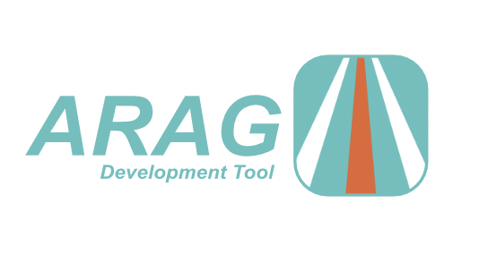

# Arag

## The official Anspar dapp builder.

Usage documentation -> [Anspar Dev page](https://anspar.io/dev)

Report bugs and get support -> [Discord](https://discord.gg/ENQfPEcrZJ)

Tutorials -> [Youtube](https://www.youtube.com/embed/6gErdx-llSg?list=PLynQF5IaLl6HypAzcdlxSqBdPshRNXtS6)

## Usage 
    arag new <project name>

live rendering and reloading of the project
    
    arag show

package the project into a single html file, remove development dependencies

    arag release
## Dev
arag uses crate `minify-html`
which requires `go` to compile. Visit `https://go.dev/` to install go

`cargo run -- show`

### Build
`cargo build --release`

If necessary create `arag.yml` file and specify custom ipfs gateway for local development

    ipfs_gateway: "https://custom/ipfs/gateway"

</img>

[anspar.io](https://anspar.io)
